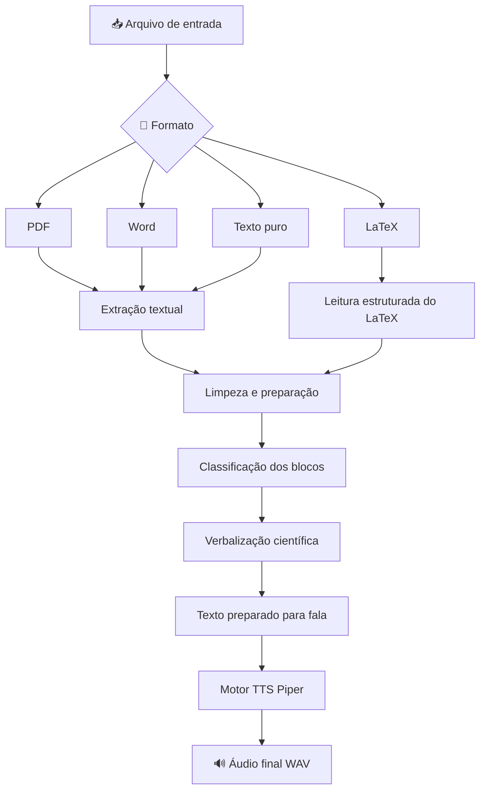
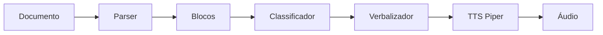

<div align="center">

# 🎧 Scientific Audio Reader

### Conversor inteligente de documentos científicos em áudio

Transforme **LaTeX de textos acadêmicos** em áudio com uma leitura mais clara, natural e adequada para conteúdos técnicos, matemáticos e científicos.

<br>


<br>

> 📚 Uma ferramenta para tornar materiais científicos mais acessíveis, escutáveis e compreensíveis.

</div>

---

## ✨ Ideia central do projeto

O **Scientific Audio Reader** é um projeto em Python criado para converter documentos científicos em áudio, com foco especial em:

- 📘 textos acadêmicos;
- 🧮 fórmulas matemáticas;
- 📊 conteúdos estatísticos;
- 🔬 materiais científicos;
- 📄 artigos, relatórios, livros e apostilas;
- ♿ acessibilidade educacional.

Diferente de uma conversão simples do tipo:

```text
PDF -> texto bruto -> áudio
```

este projeto utiliza uma pipeline intermediária de preparação textual:

```text
documento -> extração -> classificação -> verbalização científica -> síntese de voz
```

Assim, o sistema tenta transformar conteúdos técnicos em uma narração mais natural e compreensível.

---

## 🚀 Destaque importante

> O projeto aceita diferentes formatos de entrada, como **PDF, Word, LaTeX**.

No entanto, para conteúdos científicos, matemáticos e estatísticos, os melhores resultados são obtidos com arquivos em **LaTeX**.


</div>

### Por que o LaTeX gera melhores resultados?

O LaTeX preserva melhor a estrutura lógica do conteúdo científico.

Em arquivos PDF e Word, fórmulas podem ser extraídas de forma incompleta, símbolos podem ser perdidos e tabelas podem ficar desorganizadas. Já no LaTeX, expressões matemáticas permanecem mais estruturadas, facilitando a verbalização.

Exemplo:

```latex
f(x) = x^2 + 2x + 1
```

Pode ser preparado para uma leitura como:

```text
f de x é igual a x ao quadrado mais dois x mais um.
```

---

## 🧠 O problema que o projeto resolve

Leitores tradicionais de PDF geralmente não lidam bem com documentos científicos.

Uma fórmula simples visualmente pode se tornar confusa quando lida automaticamente.

Exemplo:

```text
y = β0 + β1x + ε
```

Uma leitura inadequada poderia soletrar símbolos ou ignorar partes importantes.

A proposta deste projeto é gerar uma leitura mais compreensível:

```text
y igual a beta zero mais beta um vezes x mais erro epsilon.
```

---

## 🖼️ Visão geral da solução



---

## 🧩 Pipeline principal

A pipeline do projeto foi pensada em camadas.



Cada etapa possui uma função específica:

| Etapa | Função |
|---|---|
| Parser | Extrai o texto do documento |
| Extração de blocos | Divide o conteúdo em partes menores |
| Classificação | Identifica texto, título, equação, tabela ou referência |
| Verbalização | Adapta o conteúdo técnico para fala |
| TTS Piper | Gera o áudio final |
| Gradio | Disponibiliza uma interface amigável |


---

## 🧪 Exemplo de verbalização científica

### Entrada em LaTeX

```latex
\frac{x^2 - 1}{x - 1}
```

### Saída preparada para fala

```text
fração com numerador x ao quadrado menos um e denominador x menos um.
```

---

### Entrada com símbolo estatístico

```text
β
```

### Saída preparada para fala

```text
beta
```

---

### Entrada com equação

```text
y = β0 + β1x + ε
```

### Saída preparada para fala

```text
y igual a beta zero mais beta um vezes x mais erro epsilon.
```

---

## 🧭 Modos de leitura

O sistema pode trabalhar com diferentes níveis de verbalização.

### 🟢 Modo simples

Prioriza fluidez.

Indicado para documentos com pouco conteúdo matemático ou quando o objetivo é ouvir uma versão mais direta do texto.

### 🔵 Modo técnico

Tenta verbalizar símbolos, fórmulas, termos estatísticos e expressões matemáticas.

Indicado para artigos científicos, relatórios técnicos e materiais com equações.

### 🟣 Modo acadêmico

Preserva mais detalhes do documento, incluindo maior quantidade de conteúdo técnico, seções e referências.

Indicado para uma leitura mais fiel de artigos científicos.

---

## 💻 Interface com Gradio

A interface permite que o usuário:

- 📤 envie um documento;
- 👀 visualize uma prévia do texto preparado;
- 🎚️ ajuste ou teste a velocidade da voz;
- 🔊 gere um áudio curto de teste;
- 🎧 gere o áudio completo;
- 📥 baixe o arquivo final em formato WAV.

---

## 🛠️ Instalação

### Windows

```bash
python -m venv venv
venv\Scripts\activate
pip install -r requirements.txt
pip install piper-tts
```

### Linux/macOS

```bash
python -m venv venv
source venv/bin/activate
pip install -r requirements.txt
pip install piper-tts
```

---

## 🗣️ Configuração da voz do Piper

Baixe uma voz do Piper em português brasileiro e coloque os arquivos na pasta `voices/` com os seguintes nomes:

```text
pt_BR-voz.onnx
pt_BR-voz.onnx.json
```

A estrutura esperada é:

```text
voices/
├─ pt_BR-voz.onnx
└─ pt_BR-voz.onnx.json
```

---

## ▶️ Como executar

Execute o projeto com:

```bash
python -m app.ui_gradio
```

Depois, abra no navegador:

```text
http://127.0.0.1:7860
```

## ✅ Funcionalidades atuais

- 📄 Upload de documentos;
- 📘 suporte a PDF;
- 📝 suporte planejado ou adaptável para Word, LaTeX e texto puro;
- 🔎 extração textual de documentos acadêmicos;
- 🧱 separação do documento em blocos;
- 🏷️ classificação de blocos;
- 🧮 verbalização de símbolos matemáticos;
- 📊 verbalização de equações simples;
- 📋 verbalização de tabelas simples;
- 📚 tratamento básico de referências;
- 👀 prévia do texto preparado;
- 🎚️ teste de velocidade com áudio curto;
- 🔊 geração de áudio completo;
- 📥 download do arquivo WAV;


---

## 🔬 Elementos que o sistema busca tratar

O sistema busca reconhecer e verbalizar elementos como:

| Elemento | Exemplo | Verbalização esperada |
|---|---|---|
| Letras gregas | `β` | beta |
| Expoentes | `x²` | x ao quadrado |
| Equações | `y = β0 + β1x + ε` | y igual a beta zero mais beta um vezes x mais erro epsilon |
| Frações | `1/2` | um meio |
| Funções | `f(x)` | f de x |
| Tabelas simples | linhas e colunas | leitura estruturada |
| Referências | citações acadêmicas | leitura ou filtragem conforme modo |


## ⚠️ Limitações atuais

Alguns casos ainda são desafiadores para a pipeline atual:

- PDFs escaneados com baixa qualidade;
- documentos sem camada de texto pesquisável;
- fórmulas matemáticas inseridas como imagem;
- tabelas muito complexas;
- gráficos com informação central;
- layouts irregulares;
- documentos em múltiplas colunas muito desorganizados;
- artigos com formatação incomum;
- símbolos científicos não reconhecidos pelo extrator textual.

Essas limitações são comuns em sistemas de leitura automática de documentos científicos e indicam pontos importantes para evolução futura do projeto.

---

## 🧪 Exemplo de uso recomendado com LaTeX

Para obter melhor qualidade, organize conteúdos científicos em LaTeX.

```latex
A função quadrática é dada por:

\[
f(x) = ax^2 + bx + c
\]

em que \(a\), \(b\) e \(c\) são coeficientes reais, com \(a \neq 0\).
```

Esse formato ajuda o sistema a preservar a estrutura da expressão matemática e melhora a qualidade da verbalização.

---

## 🎯 Aplicações

O projeto pode ser utilizado em diferentes contextos:

- ♿ acessibilidade educacional;
- 👨‍🏫 apoio a professores;
- 👩‍🎓 apoio a estudantes;
- 📚 leitura de artigos científicos;
- 🎧 estudo por áudio;
- 📝 revisão de materiais acadêmicos;
- 📘 transformação de apostilas em áudio;
- 🧮 apoio à leitura de Matemática e Estatística;
- 🔬 leitura de conteúdos científicos e técnicos;
- 🏫 produção de materiais didáticos acessíveis.

---


## 🧠 Diferencial científico

Este projeto não tem como objetivo apenas converter texto em áudio.

A proposta é investigar uma abordagem intermediária de **preparação linguística e científica do conteúdo** antes da síntese de voz.

Esse tipo de abordagem é relevante porque documentos científicos apresentam elementos que não são adequadamente tratados por leitores convencionais de PDF, especialmente quando há:

- equações;
- tabelas;
- símbolos;
- expressões estatísticas;
- estruturas acadêmicas;
- fórmulas matemáticas.


## 🤝 Contribuições

Contribuições são bem-vindas.

Você pode contribuir com:

- novas regras de verbalização;
- melhorias na leitura de fórmulas;
- suporte a novos formatos;
- testes com materiais científicos;
- exemplos de entrada e saída;
- melhorias na geração de áudio;
- documentação;
- ajustes na interface;
- avaliação da qualidade do áudio gerado.

---

## 👥 Autores

**Taís Alvarenga**  
**Sérgio Simão**


---

<div align="center">

## 🌟 Resumo

O **Scientific Audio Reader** transforma documentos científicos em áudio com foco em clareza, acessibilidade e compreensão.

Ele aceita diferentes formatos de entrada, mas alcança os melhores resultados com **LaTeX**, principalmente em conteúdos com fórmulas, equações e notação técnica.

<br>

> 🎧 Tornando o conhecimento científico mais acessível, escutável e compreensível.

</div>
